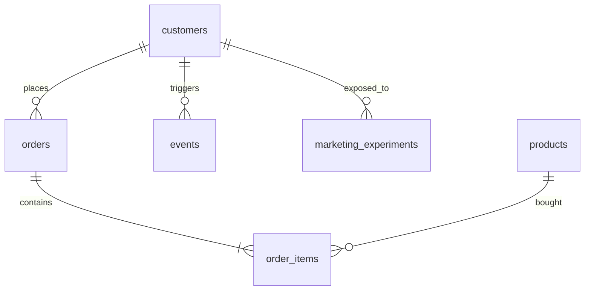

# SQL Product Analytics Labs


[](https://github.com/albertojromerot/sql-product-analytics-labs/actions/workflows/reports.yml)

A recruiter-friendly, end-to-end SQL analytics showcase that starts with synthetic e-commerce data, walks through DuckDB notebooks, and ends with ready-to-share HTML reports and Power BI theming.

> Text-only initial scaffold: notebooks live as Jupytext `.py` files; CI converts them to `.ipynb`, executes, and attaches HTML artifacts on PRs.
> Text-only initial scaffold: CI will generate PNGs and HTML reports after this PR is opened.

## Artifacts (generated by CI after PR open)
- 📄 Notebook HTML previews will be published to `reports/samples/` and linked from the PR checks.
- 🖼️ PNG charts for README snippets will be written to `assets/` by the executed notebooks.
After merge to main, CI commits HTML to `reports/samples/` and PNG charts to `assets/` so you can browse them directly in the repo.

## Reports
- [Joins & revenue KPIs](reports/samples/01_joins.html) — Appears after first CI run on main.
- [Window functions & cohorts](reports/samples/02_window_functions.html) — Appears after first CI run on main.
- [CTEs & funnel analysis](reports/samples/03_ctes_and_funnels.html) — Appears after first CI run on main.
- [A/B test marketing](reports/samples/04_ab_test_marketing.html) — Appears after first CI run on main.

## Gallery
> Thumbnails are committed by CI after the first merge to `main`.

<p align="center">
  
  
  
  
</p>

## Data model


## Repo tour
- `src/generate_data.py` – deterministic data generator producing full and sample CSVs plus schema/seed SQL.
- `data/samples/` – lightweight CSVs preloaded into the notebooks (generated by CI).
- `sql/` – schema and DuckDB COPY commands for quick setup.
- `notebooks_py/` – four guided analyses stored as Jupytext Python notebooks (joins, window functions, CTE funnels, A/B testing).
- `notebooks/` – four guided analyses (joins, window functions, CTE funnels, A/B testing).
- `reports/samples/` – HTML reports deposited by CI for quick viewing; `reports/latest/` holds fresh CI artifacts.
- `assets/` – PNG exports from the notebooks for README and decks, generated during CI runs.
- `.devcontainer/` – VS Code dev container for a consistent Python 3.10 toolchain.
- `.github/workflows/reports.yml` – CI to regenerate data and HTML artifacts.

## Data volumes
- ~20k customers, ~30k orders (with guaranteed line items) across 24 months.
- ~80k behavioral events and ~30k marketing experiment participants.
- Samples (500 rows) live in `data/samples/` for quick DuckDB demos; full CSVs regenerate into `data/synthetic/`.

## Quickstart
1. Clone and open in VS Code Dev Containers or install the dependencies from `requirements.txt`.
2. Run `python src/generate_data.py` to build deterministic synthetic data and refresh `sql/seed.sql`.
3. Convert and execute the Jupytext notebooks:
   ```bash
   mkdir -p notebooks_build reports/latest assets
   for nb in notebooks_py/*.py; do
     jupytext --from py:percent --to ipynb "$nb" -o "notebooks_build/$(basename "${nb%.py}").ipynb"
   done
   for nb in notebooks_build/*.ipynb; do
     jupyter nbconvert --to html --execute "$nb" --output-dir reports/latest
   done
   ```
4. After merge to main, CI commits HTML to `reports/samples/` and PNG charts to `assets/` so you can browse them directly in the repo.
3. Execute notebooks with `jupyter nbconvert --to html --execute notebooks/*.ipynb --output-dir reports/latest`.
4. Open the HTML reports in `reports/latest/`; CI will also publish a `reports/samples/` snapshot for browsing.

## CI pipeline
- GitHub Actions (`.github/workflows/reports.yml`) regenerates the synthetic data, executes all notebooks headlessly, saves fresh HTML to `reports/latest/`, and publishes them as build artifacts.
- The same workflow keeps the schema and seed SQL in sync with the generated samples.
